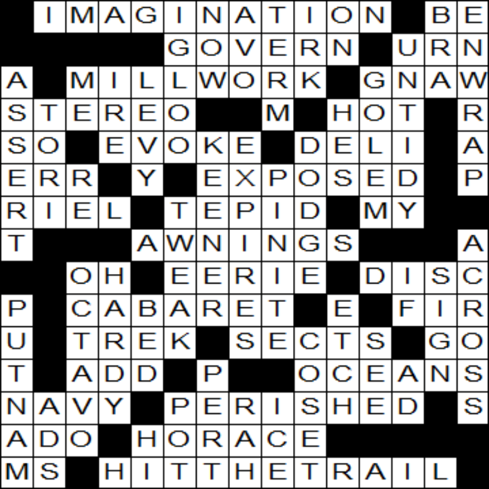

# CrosswordDesigner
Windows program to design crossword puzzles

Check out our <a href="https://malcolmmclean.github.io/CrosswordDesigner/"> webpages</a>

## How to design a crossword

Either create a random grid, or use the mouse and arrow keys to navigate.
Space sets awhite square, delete sets a black square. You can also use
the letter keys to create your own words. 

If you want to fill with random words, select "fill grid" from the menu.
It will fill in the blank spaces. If the problem is too hard for it,
it will loop forever, so click "Stop" to halt it.

Currently English-style grids usually fill up almost instantaneously,
but American-style grids can take a very long time. Try setting the word
complexity to "very rare" to help it along.

It achieved this in about five minutes. 

## Compiling
To create via CMake, create a directory called build, and navigate to it.
Then type `cmake ..`. The will create for you a Visual Studio .sln
file.

If you don't have CMake, set up a solution and drop the files into it.
You will have to define `_CRT_SECURE_NO_WARNINGS` to get the C standard
library. You will also have to add Comctl32.lib to get the controls.

